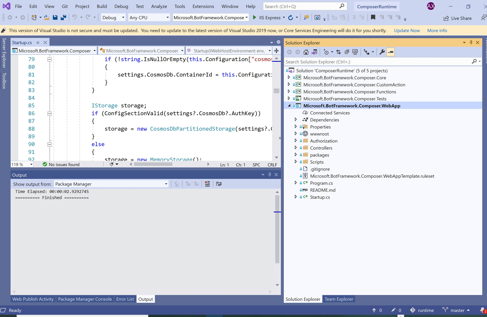

# Challenge 7: Implement DevOps best practices into your Bot 
[< Previous Challenge](./Challenge6-ACS.md) - **[Home](../README.md)** 
## Introduction
We've now finished deploying our Bot into Azure. In order to make it a enterprise level repeatable solution, the team needs to automate a CI/CD pipeline
	
## Description

1. Export our Bot to a Run Time

2. Make sure exported run time is linked to you GitHub/DevOps repo

3. Set up Continuous Integration pipeline in your GitHub/DevOps project to automatically build the Web App 

4. Set up a Continuous Deployment (CD) to deploy the project. Make sure the BOT API, QnA Knowledge Base, and LUIS are considered in the CD. 

## Success Criteria
* The Bot local Run Time is created
* Have completed CI and CD pipelines 
* What a sample result looks like:

## Resources
* [How to Export Bot Composer Project to a Run Time](https://docs.microsoft.com/en-us/composer/how-to-add-custom-action#export-runtime)
* [ASP.net core Azure DevOps Pipeline Creation and Deployment](https://docs.microsoft.com/en-us/azure/devops/pipelines/ecosystems/dotnet-core?view=azure-devops)
* [Create CI/CD for LUIS](https://docs.microsoft.com/en-us/azure/cognitive-services/luis/luis-concept-devops-automation#continuous-delivery-cd)

# Congratulations

You have finished the challenges for this Hack. 
We are updating the content continuously. In the upcoming phase 2 of this hack content we can extending this Bot solution to data services such as Azure DataBricks to unlock more advanced ML capabilities.
Stay tuned!