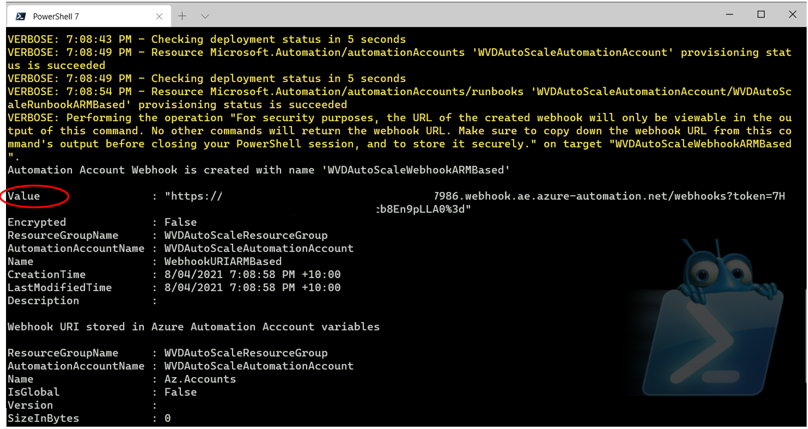
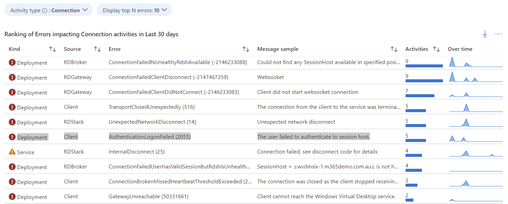
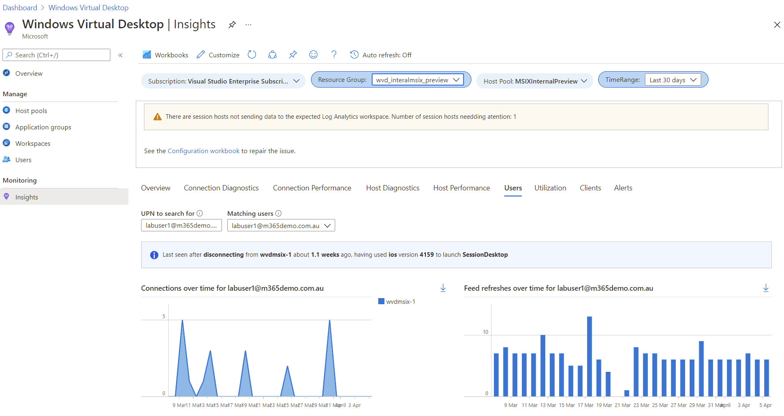
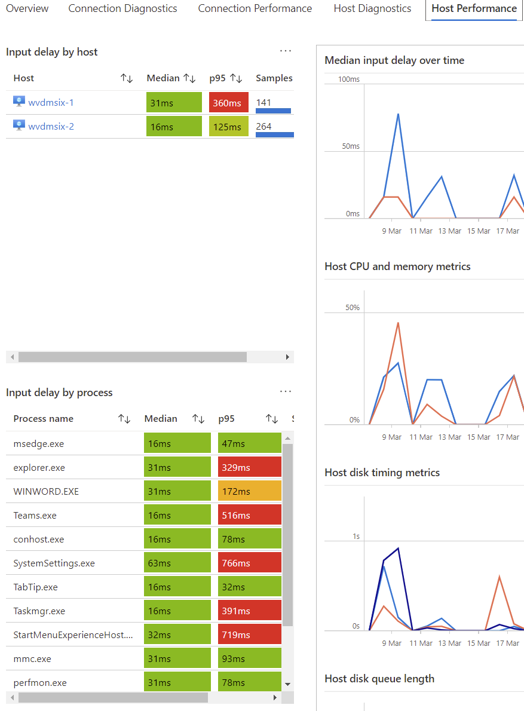
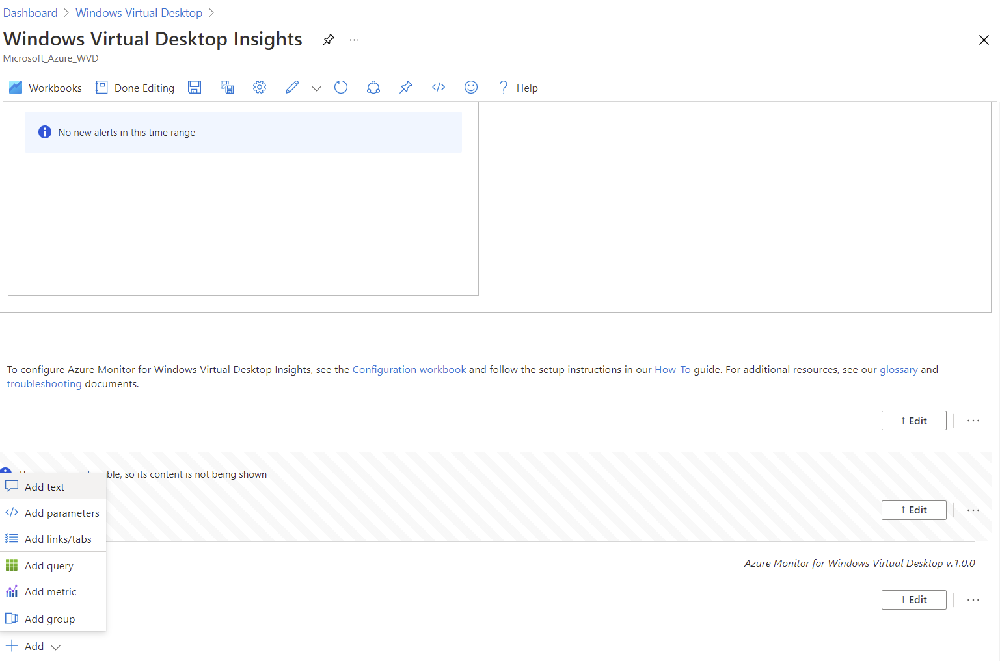
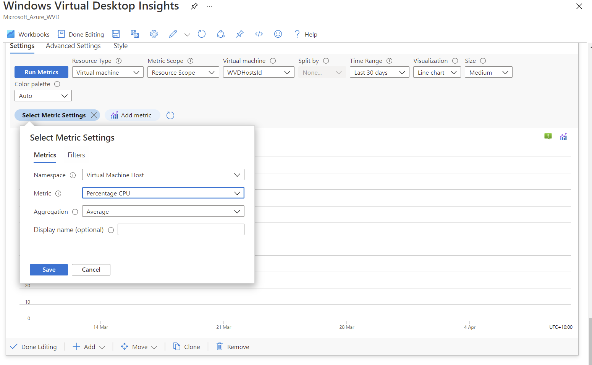

# Challenge 10: Monitor and Manage the Performance and Health of your WVD Environment

[< Previous Challenge](./09-Automate-WVD-Tasks.md) - **[Home](./README.md)** - [Next Challenge>](./11-Configure-User-Experience-Settings.md)

## Notes & Guidance

Students should be able to demonstrate a number of key elements to be successful in this challenge. They are expected to deploy the following WVD services and features.

- WVD Azure Monitor Insights portal
- WVD Autoscaling Session Hosts

### WVD Monitoring Setup

- At least one Log Analytics workspace. [Create a Log Analytics Workspace in Azure Portal](https://docs.microsoft.com/en-us/azure/azure-monitor/logs/quick-create-workspace)
- Enable data collection for the following things in their Log Analytics workspace:
    - Diagnostics from their Windows Virtual Desktop environment
    - Recommended performance counters their Windows Virtual Desktop session hosts
    - Recommended Windows Event Logs from their Windows Virtual Desktop session hosts 
    - [Configuration of Workbook requirements](https://docs.microsoft.com/en-us/azure/virtual-desktop/azure-monitor#set-up-using-the-configuration-workbook)
- Students should configure the Azure Monitor Agent and enable all required counters [Azure Monitor for WVD documentation](https://docs.microsoft.com/en-us/azure/virtual-desktop/azure-monitor). 
- Data typically flows within a few minutes of enabling the agent and counters however only new data will be received so testing should occur after confirmation that some data is being recieved by Log Analytics.
- Enabling alerts is an optional feature and not required for the purpose of this challenge however in operational environments it is recommend after baselines of the environment are performed. We don't offer fixed guidance on what alerts should be enabled today however the below links offer some suggestions and guidance on what customers may consider in a real environment.

**Sample Queries**
Sample KQL Queries to verify data is being received by Log Analytics Workspace, run each query separately. Running the query will display the Resource ID to also confirm that data is being received from the various diagnostic activity types. 

```KQL
// Verify Windows Event Log events are being received by Log Analytics
Event | summarize count() by Source, Computer, _ResourceId

// Display all WVD Connection based Diagnostic Events across the host pool
WVDConnections | summarize count() by ConnectionType, SessionHostName, ResourceAlias, _ResourceId

// Summarise count of all WVD Errors received from WVD Diagnostic Events
WVDErrors | summarize count() by Source, ActivityType, _ResourceId

// Summarise count of all WVD Checkpoint events received from WVD Diagnostic Events
WVDCheckpoints | summarize count() by Source, ActivityType, _ResourceId
```

#### WVD Scaling Script Setup (Was setup in Challenge 9, but here is referece material)

- Following the guide on the [WVD Scaling Script](https://docs.microsoft.com/en-us/azure/virtual-desktop/set-up-scaling-script) docs page
- Requirements
    - [WVD Desktop Virtualisation PowerShell Module](https://docs.microsoft.com/en-us/azure/virtual-desktop/powershell-module)
    - Contributor Level Role on Subscription or Higher
    - Run PowerShell to download customisation script
        ```PowerShell
        New-Item -ItemType Directory -Path "C:\Temp" -Force
        Set-Location -Path "C:\Temp"
        $Uri = "https://raw.githubusercontent.com/Azure/RDS-Templates/master/wvd-templates/wvd-scaling-script/CreateOrUpdateAzAutoAccount.ps1"
        # Download the script
        Invoke-WebRequest -Uri $Uri -OutFile ".\CreateOrUpdateAzAutoAccount.ps1"
        ```
    - When following the steps to generate the Automation account students will need to record the webhook URI and Workspace name for Log Analytics if set in steps 3 and 4 of the parameters [(docs)](https://docs.microsoft.com/en-us/azure/virtual-desktop/set-up-scaling-script#create-or-update-an-azure-automation-account) as they will be used later in the setup. **This stage can take over 15-20mins to complete**

     
    - Students will need to create an [Azure Automation Run As Account](https://docs.microsoft.com/en-us/azure/virtual-desktop/set-up-scaling-script#create-an-azure-automation-run-as-account) once the Automation Account has been created successfully. 
    - Students will need to then create the [Logic App and define the execution schedule](https://docs.microsoft.com/en-us/azure/virtual-desktop/set-up-scaling-script#create-the-azure-logic-app-and-execution-schedule). This is where the autoscale rules are defined and to meet the criteria of this challenge should be configuring the following values (all others are not required or can be left as default)
        - WebhookURI: As recorded from the output of the Automation account creation
        - BeginPeakTime: 08:00 (8am is set as start of peak and not 9:30am. We want machines to start scaling out from 8am although we would expect the load balancing using ['depth-first' load balancing configuration](https://docs.microsoft.com/en-us/azure/virtual-desktop/configure-host-pool-load-balancing) to reduce the number of machines with low user density as demand picks up)
        - EndPeakTime: 19:00 (this is when users would expect the machines to begin scaling down. Some environments may add some padding to the end of peak times but would not expect this to be more than 15-30mins beyond the typical end of shift especially for this customer scenario when it's operating a 'follow the sun' operation. 
        - TimeDifference: This will depend on the location of the chosen host pool but should be set to the local time zone to be correct. Default: "-7:00"
        - SessionThresholdPerCPU: 1 (this is to allow easier testing and demonstration of scaling without having to add too many sessions if the threshold was higher)
        - MinimumNumberofRDSH: 5% of the host pool session hosts to meet business objectives. (this can be set to a lower/higher value as required for the lab however students should be able to explain this value is needing to allow for off-peak hosts to support after-hours remote users)
        - LimitSecondstoForceLogOffUser: 300 (300secs is 5mins before users will be force logged off hosts during scale-in at the end of the day)
        - LogOffMessageTitle and LogOffMessageBody: Any title and body text respectively to warn users they will be logged off in 5mins and that they should save their work and try to reconnect shortly.


Students need too:

1. Identify the top errors preventing users from connecting over the past 24 hours
    - Using WVD Insights Monitor within WVD Blade
    - Ensure Time Range is set to 24hrs
    - Navigate to the ***Connection Diagnostics*** tab
    - Point out the ***Ranking of Errors impacting Connection activities in Last 24hrs*** section and;
        - Demonstrate where they have "ActivityType: Connection" 
        - Show the ranking of errors 

        

1. Select a host pool and show a view with the following information for each WVD host: New Session Status, Stack Version, Current Sessions, Available Sessions
    - Using WVD Insights Monitor within WVD Blade
    - Overview tab and expanding the selected hostpool show current information on the host status. 

    

1. Display recent user activity in WVD activity for a specific user including their most recent login and history within the past 30 days
    - Using WVD Insights Monitor within WVD Blade
    - Change "TimeRange" dropdown parameter to "Last 30 Days"
    - Open "Users" tab, enter UPN of user to search and choose from matching users
    - Students should be able to show the history of connections over the time range and demonstrate key items such as last seen, client types and errors impacting connectivity.

    

1. Identify performance metrics of a WVD host which has a currently connected user and demonstrate how you can view the "User Input Delay per Process" object and "Max Input Delay" counters for that VM. 
    - Using WVD Insights Monitor within WVD Blade
    - Open "Host Performance" tab and scroll down to "Input delay by process"
    - [User Input Delay Counters](https://docs.microsoft.com/en-us/windows-server/remote/remote-desktop-services/rds-rdsh-performance-counters) require the students to successfully add custom performance counters as per requirements of WVD Insights

    

1. Enable automatic scaling of WVD session hosts to start and stop machines during peak/off-peak hours across each region. 
    - Students should be able to demonstrate a successful deployment of the [WVD Scaling Script](https://docs.microsoft.com/en-us/azure/virtual-desktop/set-up-scaling-script) **NOTE:** which they may have already completed in Challenge 9*
    - Have students open the Logic Apps Designer View to show the HTTP Post step and values that have been configured as per the above setup notes. Confirm they have values as expected in the Body fields and consider reasoning behind why values may be different (ie MinimumNumberofRDSH/SessionThresholdPerCPU) for purpose of the challenge. 
    - Extra points if the students have configured 'depth-first' load balancing (non-default setup so students will have to change this themselves). Depth-first will distribute users to an available session host with the highest number of connections but has not reached its maximum session limit threshold. This would meet the goal of the company to reduce underutilised machines. It can also reduce session sprawl towards the end of the day but isn't always guaranteed to do so. 
    - Ideally you should have the team demonstrate a successful peak/off-peak transition if time permits but this may require adjustments to the times set and frequency of the job within the Logic App Designer before attempting. Viewing the scaling tool logs will give an indication of success/failure of the job running if time is running out. 

    

## Advanced Challenges (Optional)

1. Modify the WVD Insights portal to display the CPU % performance metric for the current host pool on the front page of the dashboard. You will need to ensure the metric is only displayed on the Overview tab. 
    - Students should be able to show a custom CPU performance metric being added to their edited WVD Insights workbook. 
    - Open the WVD Insights page then "Select Customise" 
    - In the next page "Select Edit" 
    - For faster changes scroll to the bottom and look for the +Add menu  and select "add metric"

    

    - Metric Scope: Resource Scope
    - Virtual Machine dropdown: "WVDHostsId" selected and add the VM CPU Performance counter. 
    

    - Save work by first hitting the done editing button and choosing the "Save As" option before hitting Done edit. Users, if successful will have a new metric counter that they added.

## Learning Resources

- [Use Azure Monitor for WVD to monitor environment](https://docs.microsoft.com/en-us/azure/virtual-desktop/azure-monitor)
- [Use Log Analytics for the diagnostics feature](https://docs.microsoft.com/en-us/azure/virtual-desktop/diagnostics-log-analytics)
- [Diagnostic Role Service](https://docs.microsoft.com/en-us/azure/virtual-desktop/diagnostics-role-service)
- [Troubleshoot Azure Monitor](https://docs.microsoft.com/en-us/azure/virtual-desktop/troubleshoot-azure-monitor)
- [Azure Monitor for WVD](https://docs.microsoft.com/en-us/azure/virtual-desktop/azure-monitor)
- Perform an online [CPU Stress Test](https://cpux.net/cpu-stress-test-online) to simulate CPU load for a user session. 
- Virtual Machine sizing guidelines for [WVD sessions](https://docs.microsoft.com/en-us/windows-server/remote/remote-desktop-services/virtual-machine-recs)
- Using [performance counters](https://docs.microsoft.com/en-us/windows-server/remote/remote-desktop-services/rds-rdsh-performance-counters) to diagnose app performance problems on Remote Desktop Session Hosts.
- Create a [Log Analytics Workspace](https://docs.microsoft.com/en-us/azure/azure-monitor/logs/quick-create-workspace)
- [Azure Advisor](https://docs.microsoft.com/en-us/azure/virtual-desktop/azure-advisor) can help resolve common issues in your environment without having to file support cases
- [Azure Monitor workbook groups](https://docs.microsoft.com/en-us/azure/azure-monitor/visualize/workbooks-groups) and [Metric Charts](https://docs.microsoft.com/en-us/azure/azure-monitor/visualize/workbooks-chart-visualizations#metric-charts)
- [Scale WVD Sessions Automatically](https://docs.microsoft.com/en-us/azure/virtual-desktop/set-up-scaling-script)
- [WVD Host Pool Load Balancing Options](https://docs.microsoft.com/en-us/azure/virtual-desktop/host-pool-load-balancing)
