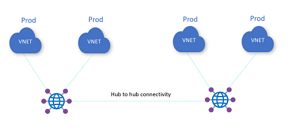

# Challenge 1: Any to Any connectivity

**[Home](../README.md)** - [Next Challenge >](./02-vpn.md)

## Introduction

In this challenge you will be connecting several VNets to Virtual WAN and achieve a full mesh connectivity. This will be the foundation for more complex scenario's in future challenges.

## Description

Please check with your coach whether the VNets have been pre-created or whether they need to be created as part of this challenge.

Deploy an Azure Virtual WAN with 2 hubs. Connect 2 VNets on each hub. Especially for deploying VMs and VNets, it is recommended using the Azure CLI ([az vm create](https://docs.microsoft.com/cli/azure/vm?view=azure-cli-latest#az_vm_create)) or Azure PowerShell ([New-AzVM](https://docs.microsoft.com/powershell/module/az.compute/new-azvm)).

If you want to save some time there's a sample Azure CLI script available [here](./Resources/create_vnet_with_vm.md) which allows you to easily create multiple VNets with a test VM in each of them.

Sample topology:

## Success Criteria

- Make sure Virtual Machines from different VNets on the same hub can communicate
- Make sure Virtual Machines from different VNets on different hubs can communicate

## Learning Resources

- [Virtual WAN any-to-any across hubs](https://docs.microsoft.com/azure/virtual-wan/scenario-any-to-any)
- [az vm create](https://docs.microsoft.com/cli/azure/vm?view=azure-cli-latest#az_vm_create)
- [New-AzVM](https://docs.microsoft.com/powershell/module/az.compute/new-azvm)
- [Example with az vm create](./Resources/create_vnet_with_vm.md)