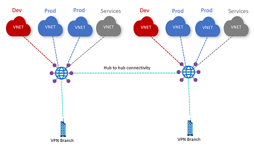

# Challenge 3: Isolated Virtual Networks

[< Previous Challenge](./02-vpn.md) - **[Home](../README.md)** - [Next Challenge >](./04-secured_hub.md)

## Introduction

This challenge will help you understand the custom routing feature of Virtual WAN by configuring routing in such a way that several VNets are isolated from each other.

## Description

Deploy 2 more VNets on each hub. Make sure each hub has 4 VNets in total. Those 4 VNets in each hub will have different roles:

- 1 VNet will be used for Development
- 2 VNets will be used for Production
- 1 VNet will be used for Common Services

Sample topology:

## Success Criteria

- The Development VNet should be able to communicate with the other Development VNet in the other hub, and to both Common Services VNets
- The Production VNets should be able to communicate with the other Production VNets (same hub and across hubs), and to both Common Services VNets
- The Development VNets should not be able to communicate to the Production VNets
- All VNets should be able to communicate with the VPN branches

## Learning Resources

- [Virtual WAN custom routing ](https://docs.microsoft.com/azure/virtual-wan/about-virtual-hub-routing)
- [Virtual WAN isolated Vnets](https://docs.microsoft.com/azure/virtual-wan/scenario-isolate-vnets)
